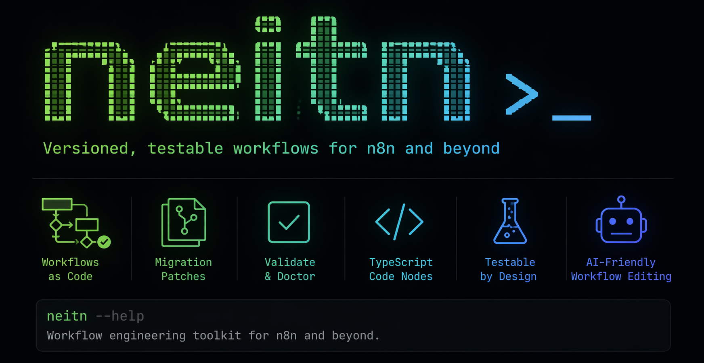

neitn>_

`neitn` is an AI-native CLI for modular n8n workflows.

Instead of editing one large exported n8n JSON file, `neitn` works with a project DSL:

- `flow.yaml`
- `nodes/*.yaml`
- `edges/*.yaml`
- `code/*.ts`
- `code/*.runtime.ts`
- `code/__tests__/*.test.ts`

This keeps AI tasks smaller, diffs cleaner, and Code nodes testable.

## Why This Exists

Raw n8n workflow JSON is expensive for AI to edit well:

- too much context
- too easy to rewrite unrelated parts
- hard to patch safely
- hard to test Code nodes

`neitn` solves that by splitting workflow structure and code into small files, then compiling back to standard n8n workflow JSON.

## Install

### From npm

```bash
npm install -g neitn
```

This installs the `neitn` CLI and an npm package that contains the bundled AI contract files.

To install the AI contract into a workflow project, use:

```bash
neitn agents:install . --ai codex
```

Inside a source checkout, the bundled source files live at:

- `.agents/skills/neitn/`
- `docs/neitn/`

In a global npm install, they are shipped inside the installed package directory.

There is no separate `neitn skills install` step today.

### Local development

```bash
npm install
npm run build
npm run link:global
```

## Commands

```bash
neitn init my-flow
neitn init my-flow --ai codex
neitn agents:install . --ai codex
neitn validate .
neitn apply .workflow/patches/some.patch.json
neitn doctor .
neitn migrate .
neitn build .
neitn compile .
neitn import workflow.json
neitn code:scaffold assemble_final_response --node
neitn code:test .
neitn code:build .
```

## What neitn Does Today

`neitn` already supports:

- project bootstrap with `neitn init`
- AI contract install with `neitn agents:install`
- import from existing n8n workflow JSON
- modular DSL editing through files
- `apply` and `migrate` for patch packages
- validate / doctor / compile / build
- Code node scaffold and split runtime/pure/test files

What `neitn` does **not** do by itself:

- it does not generate patches on its own
- it does not include an autonomous AI agent runtime
- it does not yet turn a free-form natural-language request into a patch by itself

Patch generation is expected to come from:

- an external AI agent using the bundled skill contract
- not from humans manually writing patch JSON as the normal workflow

## Workflow Lifecycle

### Import existing n8n workflow

```bash
neitn import workflow.json
```

This creates a modular project:

```txt
flow.yaml
nodes/
edges/
code/
dist/
```

### Create a new workflow from scratch

```bash
neitn init my-flow --ai codex
cd my-flow
neitn code:scaffold normalize_input --node
neitn validate .
neitn build .
```

That gives you:

- `flow.yaml`
- `nodes/normalize_input.yaml`
- `code/normalize_input.ts`
- `code/normalize_input.runtime.ts`
- `code/__tests__/normalize_input.test.ts`

You then add or edit:

- more `nodes/*.yaml`
- `edges/*.yaml`
- pure code in `code/*.ts`
- runtime wrappers only when n8n I/O needs to change

At this stage, creating a new workflow is a file-first flow. `neitn` gives you the project structure, scaffolded Code nodes, validation, import, build, apply, and migrate. It does not yet include a built-in prompt-to-patch generator.

If you already have a project and want to prepare it for an AI agent later:

```bash
cd my-flow
neitn agents:install . --ai codex
```

### Validate and build

```bash
neitn validate .
neitn doctor .
neitn build .
```

### Compile only

```bash
neitn compile .
```

Output:

```txt
dist/<flow.id>.workflow.json
```

## Code Nodes

New Code nodes can be scaffolded:

```bash
neitn code:scaffold assemble_final_response --node
```

This generates:

```txt
code/assemble_final_response.ts
code/assemble_final_response.runtime.ts
code/__tests__/assemble_final_response.test.ts
nodes/assemble_final_response.yaml
```

The intended split is:

- `*.ts`: pure business logic
- `*.runtime.ts`: thin n8n runtime wrapper
- `__tests__/*.test.ts`: unit tests for pure logic

Build injects the compiled runtime wrapper into final n8n JSON as `parameters.jsCode`.

## Creating Nodes

Today there are two practical ways to create workflow pieces.

### 1. Direct file-first workflow

Use the CLI and edit the DSL directly:

```bash
neitn init my-flow
cd my-flow
neitn code:scaffold assemble_final_response --node
```

Then:

1. edit `nodes/*.yaml`
2. edit `edges/*.yaml`
3. edit `code/*.ts`
4. run `neitn build .`

This path is fully ready now.

### 2. AI patch workflow

If an external AI agent uses the bundled skill contract, it can emit patch JSON targeting the DSL.

Then you apply it with:

```bash
neitn apply .workflow/patches/your.patch.json
```

or migrate a folder of patches with:

```bash
neitn migrate .
```

This means:

- AI creates the patch
- `neitn` applies and validates it
- `neitn build .` compiles the final workflow JSON

So yes: patch-based AI editing is part of the model, but the current CLI does not itself generate those patches.

Humans normally should not hand-author patch JSON. For humans, the primary interface is the DSL files themselves.

### 3. Migration flow

If you keep patch files in `.workflow/patches/`, `neitn` can apply them as an ordered migration stream:

```bash
neitn migrate .
neitn validate .
neitn build .
```

This is ready now for applying existing patch files. What is not built into `neitn` yet is automatic patch authoring from natural language.

## AI Editing Model

`neitn` is built so an AI agent can make smaller, higher-quality changes.

Source of truth:

- `flow.yaml`
- `nodes/*.yaml`
- `edges/*.yaml`
- `code/*`

Generated artifact:

- `dist/*.workflow.json`

The intended editing pattern is:

1. read only affected DSL files
2. change the smallest possible set of files
3. run `neitn validate .`
4. run `neitn build .`

## Bundled Skills

The npm package contains the AI skills bundle.

In a repo checkout, the main entrypoint is:

```txt
.agents/skills/neitn/
```

These files are intended for AI-assisted workflow editing, not for runtime execution.

They describe:

- DSL conventions
- patch/editing rules
- import/build behavior
- code node structure
- roadmap/spec decisions

If you install `neitn` from npm, the skills ship inside the package so another agent can reuse the same editing contract with lower token cost.

There is no separate extra install step for skills inside the npm package. The main practical options today are:

- use `neitn init <name> --ai codex`
- or run `neitn agents:install . --ai codex` inside an existing project
- or use the repo checkout directly

The main skill entrypoint is:

```txt
.agents/skills/neitn/SKILL.md
```

The broader spec bundle lives under:

```txt
docs/neitn/
```

This keeps the installable skill entrypoint small while preserving the full AI contract and roadmap docs.

In practice:

- the skill tells an AI agent how to work against the DSL
- the docs bundle gives the deeper contracts and roadmap context
- the CLI executes validate/apply/build/compile steps

## Recommended Packaging Model

For distribution, treat `neitn` as two layers:

### Runtime layer

- CLI
- compiler
- validator
- import/build pipeline

### AI layer

- bundled skills
- workflow editing conventions
- specs and contract docs

That combination is what makes the system useful for AI-native workflow development.

## Current Scope

Included today:

- modular workflow DSL
- import from existing n8n workflow JSON
- validate / doctor / compile / build
- Code node scaffold
- Code node split runtime/pure/test files
- workflow round-trip fidelity improvements

Not the goal of v0:

- perfect automatic refactoring of arbitrary imported `jsCode`
- full n8n runtime simulation
- secret extraction or credential provisioning

## Example Flow

```bash
neitn import workflow.json
neitn build .
```

After that:

- edit `nodes/*.yaml`
- edit `code/*.ts`
- run tests with `neitn code:test .`
- rebuild with `neitn build .`

## Example: AI + Patches

If you have an external agent that understands the bundled skill:

1. it reads `.agents/skills/neitn/SKILL.md`
2. it edits DSL files directly or emits a patch package
3. you run:

```bash
neitn apply .workflow/patches/2026-04-24-some-change.patch.json
neitn validate .
neitn build .
```

If you keep patches as a migration stream:

```bash
neitn migrate .
neitn validate .
neitn build .
```

That workflow is supported now.

## Example: Human + AI Flow

One practical flow today looks like this:

1. create the project:

```bash
neitn init my-flow --ai codex
cd my-flow
neitn code:scaffold normalize_input --node
```

2. let an external AI agent read:

```txt
.agents/skills/neitn/SKILL.md
docs/neitn/
```

3. the agent either:

- edits `flow.yaml`, `nodes/*.yaml`, `edges/*.yaml`, `code/*.ts` directly
- or writes a patch file into `.workflow/patches/`

4. then you run:

```bash
neitn validate .
neitn code:test .
neitn build .
```

5. if you are using patch files as history:

```bash
neitn migrate .
neitn build .
```

This means the current model is already usable for small AI tasks, but patch generation itself still belongs to the external agent layer, not to the CLI.

## Notes

- DSL internal edges use node ids
- final n8n JSON connections use node names
- `dist/*.workflow.json` is generated output, not the editable source format
